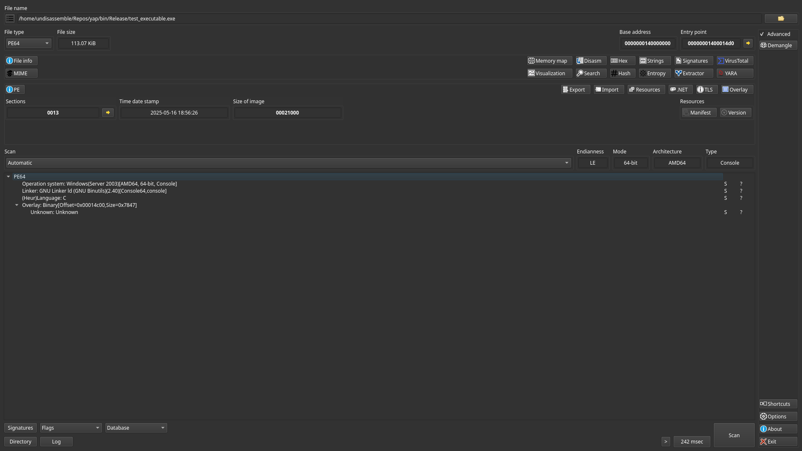
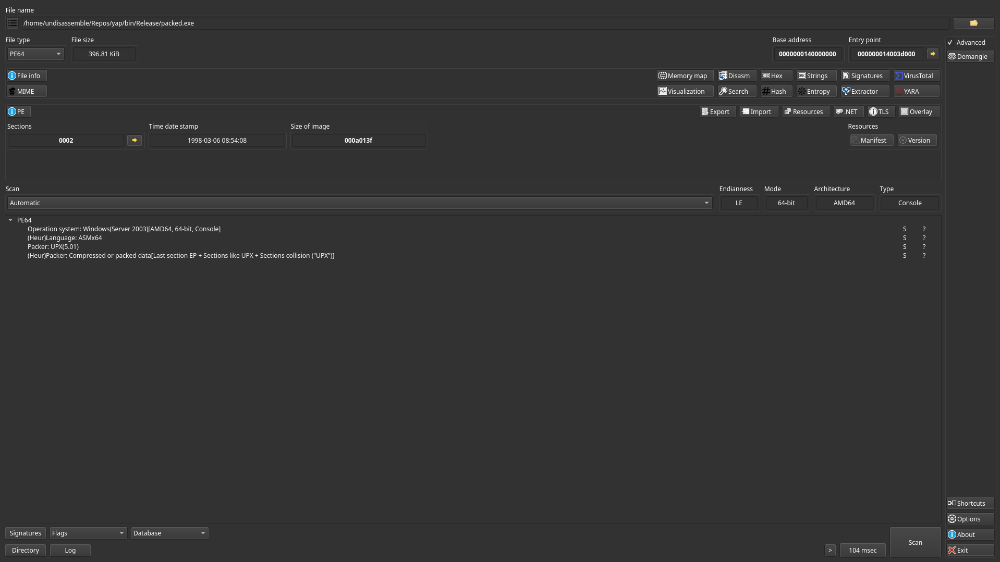
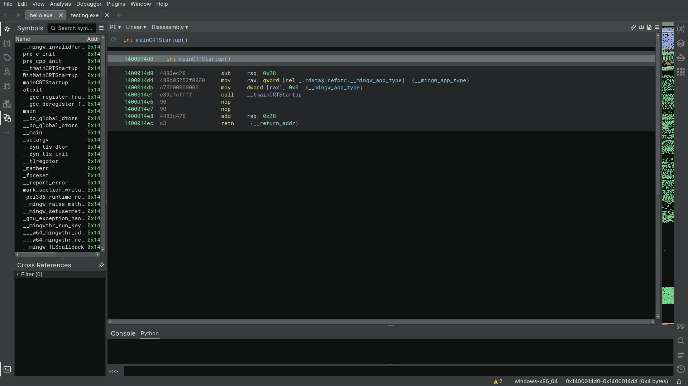
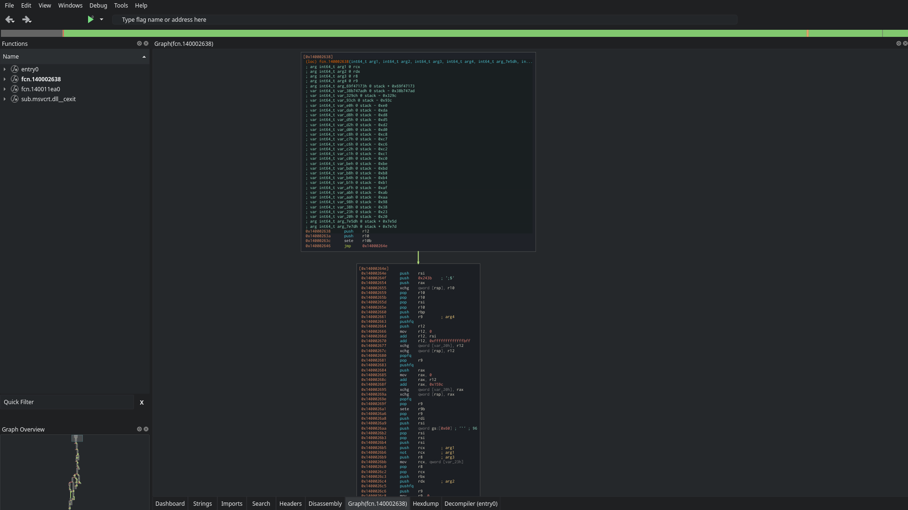

# Yet Another Packer

> [!WARNING]
> YAP is still in development, expect instability and bugs.

Protector for x86_64 Windows PE's (exe, dll). This does not support C#.

Yet Another Packer currently contains two main methods of obfuscation: the packer and the reassembler. The packer wraps the original application in a protective layer to prevent static analysis, along with additional features like anti-debug and anti-dump to make dynamic analysis more difficult. The reassembler disassembles the application and assembles it again using YAP's mutation engine.

| Feature     | Unprotected                              |                              Protected |
|-------------|------------------------------------------|----------------------------------------|
| Packer      |  |  |
| Reassembler |    |    |


## Notes on the SDK

- You need `yap.h` and `yap.dll`, these are installed when you install YAP (`YAP path/SDK`).
- Always ensure that `__YAP_VERSION__` matches your packer version (ignoring the patch should be fine).
- You must link to `yap.dll` directly, so that it appears in the applications import directory. **Do not rename yap.dll**.
- After protection, `yap.dll` is unlinked, you don't need to (and shouldn't) distribute `yap.dll` along with your application.
- You cannot use `GetModuleHandle`/`GetProcAddress` to resolve `yap.dll` imports.
- Reassembler related macros are compiled in a linear direction, so control flow optimizations could result in things not working as intended.
    - Also, avoid writing wrapper functions around these, they should be used as markers around other code blocks.


Reassembler macro example:
```cpp
#include <stdio.h>
#include "yap.h"

void protect();
void unprotect();

int main() {
    printf("Hello World!\n");

    // Right
    YAP_SUBSTITUTION(1);
    YAP_MUTATIONLEVEL(5);
    printf("Obfuscated code\n");
    YAP_SUBSTITUTION(0);
    YAP_MUTATIONLEVEL(0);

    // Wrong
    protect();
    printf("Unobfuscated code\n");
    unprotect();

    return 0;
}

// Because of how to reassembler assembles code, these don't protect anything*.
void protect() {
    YAP_SUBSTITUTION(1);
    YAP_MUTATIONLEVEL(5);
}

// *they actually protect whatever is written here, assuming when it's compiled these functions follow each other in memory.

void unprotect() {
    YAP_SUBSTITUTION(0);
    YAP_MUTATIONLEVEL(0);
}
```

## Building

### Basic build

```
cmake . -DCMAKE_BUILD_TYPE=Release
cmake --build .
```

### Build Options

`CMAKE_BUILD_TYPE` can be either `Release` or `Debug` (default).


## Other

- [Main page](https://undisassemble.dev/yap)
- [GitHub](https://github.com/undisassemble/yap)


## License

Yet Another Packer is licensed under the MIT License. Third party licenses can be found in `docs/licenses`.