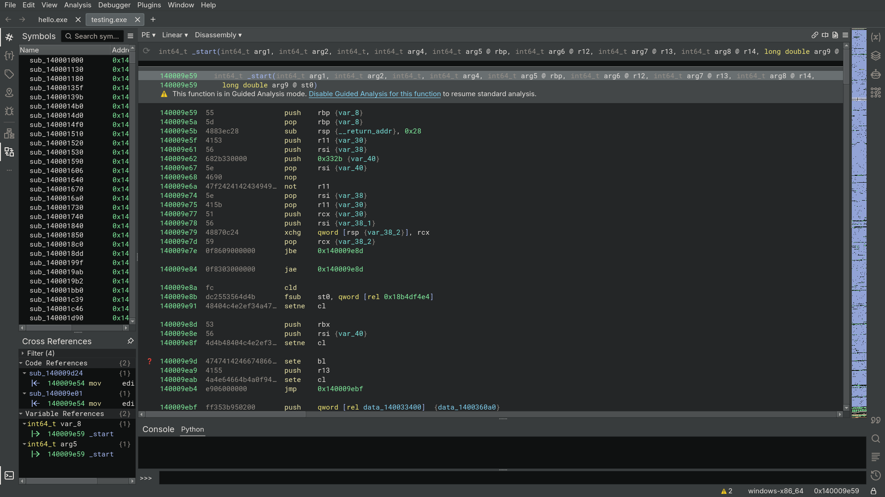

# Yet Another Packer

> [!WARNING]
> YAP is still in development, expect instability and bugs.

Protector for AMD64 Windows PE's (exe, dll). This does not support C#.

Yet Another Packer currently contains two main methods of obfuscation: the packer and the reassembler. The packer wraps the original application in a protective layer to prevent static analysis, along with additional features like anti-debug and anti-dump to make dynamic analysis more difficult. The reassembler disassembles the application and assembles it again using YAP's mutation engine.

| Feature     | Unprotected                              |                              Protected |
|-------------|------------------------------------------|----------------------------------------|
| Packer      |  |  |
| Reassembler |    |    |


## Building

### Basic build

```
cmake . -DCMAKE_BUILD_TYPE=Release
cmake --build .
```

### Build Options

`CMAKE_BUILD_TYPE` can be either `Release` or `Debug` (default).


## Other

- [Main page](https://undisassemble.dev/yap)
- [GitHub](https://github.com/undisassemble/yap)
- [SDK Documentation](https://undisassemble.dev/yap/docs/yap_8h.html)


## License

Yet Another Packer is licensed under the MIT License. Third party licenses can be found in `docs/licenses`.